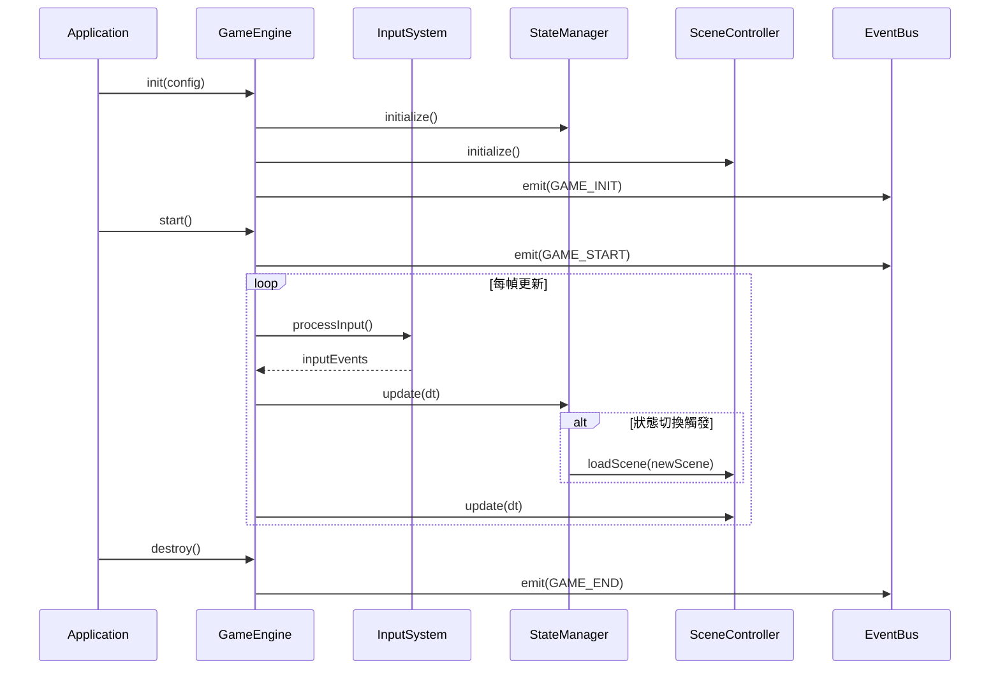
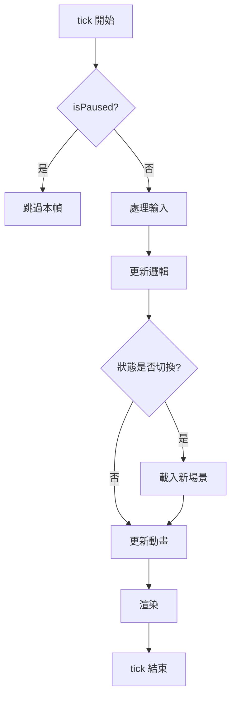

## 這個機制做什麼

遊戲主循環是驅動整個應用程式持續運作的核心機制。每一幀，它會依序執行輸入處理、邏輯更新、渲染，確保所有子系統以正確的順序和時序運行。

## 完整運作流程

1. **初始化階段**：`GameEngine.init()` 建立所有子系統
2. **啟動**：`GameEngine.start()` 開啟主循環
3. **每幀更新**（重複）：
   1. 框架呼叫 `GameEngine.tick(dt)`
   2. 處理輸入事件
   3. 更新遊戲邏輯（StateManager）
   4. 更新動畫與物理
   5. 渲染畫面
4. **暫停/恢復**：外部可呼叫 `pause()` / `resume()` 暫停循環
5. **結束**：`GameEngine.destroy()` 清理資源

## 時序圖

此圖展示主循環啟動到每幀更新的完整互動順序：

## 流程圖

此圖展示每幀 tick 內部的決策邏輯：

## 涉及的 class 與各自職責

| Class | 在此機制中的角色 |
|-------|-----------------|
| **GameEngine** | 主循環擁有者，決定更新順序，驅動所有子系統 |
| **StateManager** | 在 tick 中被呼叫，處理狀態轉換邏輯 |
| **SceneController** | 在 tick 中被呼叫，管理場景切換 |

## 如果要修改這個功能，動哪裡

- **改更新順序**：修改 `GameEngine.tick()` 內部的呼叫順序
- **加新子系統**：在 `GameEngine` 新增子系統引用，在 `tick()` 中加入呼叫
- **⚠️ 注意**：更改 tick 順序可能導致時序依賴的 bug，需要充分測試

## 學習要點

1. **固定順序是有意設計**：輸入 → 邏輯 → 渲染的順序確保了輸入能在同一幀被處理。
2. **dt 參數**：delta time 用於平滑不同幀率下的行為，所有依時間的邏輯都應使用 dt。

## 待補充

- 無。
